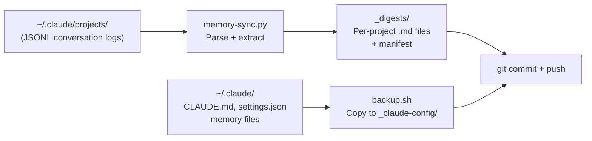
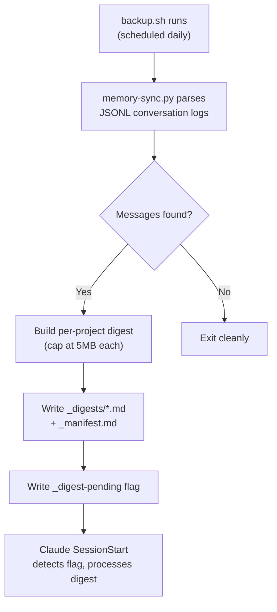

# Claude Backup System

[](https://www.python.org/downloads/)
[](LICENSE)
[]()

Portable daily backup for Claude Code CLI users. Parses conversation logs into readable markdown digests, syncs config and memory files, commits and pushes to a Git repo.

Zero external dependencies. Standard library Python only.

---

## How It Works

One script. Run it daily. Everything ends up version-controlled on GitHub.

```
backup.sh
  |
  |-- 1. Generate digests    (update-memory.sh -> memory-sync.py)
  |-- 2. Sync config          (CLAUDE.md, settings.json, memory files)
  |-- 3. Commit + push        (to your backup repo)
```

### Daily Backup Flow



### Digest Processing Flow

When Claude picks up a new digest (via SessionStart hook detecting `_digest-pending`):



---

## What Gets Backed Up

| Source | Destination | Description |
|---|---|---|
| `~/.claude/projects/*.jsonl` | `_digests/*.md` | Conversation logs parsed into readable markdown, one file per project |
| `~/.claude/projects/**/*.jsonl` | `_conversations/` | Raw JSONL archive (incremental, append-only) |
| `~/.claude/CLAUDE.md` | `_claude-config/CLAUDE.md` | Global Claude Code instructions |
| `~/.claude/settings.json` | `_claude-config/settings.json` | Claude Code settings |
| `~/.claude/projects/*/memory/*.md` | `_claude-config/memory/` | All project memory files |
| `~/Desktop/Claude/Kontext/kontext.db` | `_claude-config/kontext.db` | Kontext memory database (SQLite online backup) |

> **Security:** Memory files, `kontext.db`, and `settings.json` may contain personal data and internal paths. **Ensure your backup repo is PRIVATE** before running.

---

## Quick Start

```bash
# 1. Clone into your backup repo (must contain _claude-config/ directory)
git clone <your-backup-repo> && cd <your-backup-repo>

# 2. Create the expected directory structure
mkdir -p _claude-config/memory _conversations _digests

# 3. Run the backup
./backup.sh
```

That's it. Logs go to `_backup.log`.

---

## Usage

```bash
# Full backup: digest + sync + commit + push
./backup.sh

# Custom commit message
./backup.sh "manual backup before config change"

# Digest only (no sync, no commit)
./update-memory.sh              # last 1 day
./update-memory.sh 7            # last 7 days
./update-memory.sh --all        # full history

# Python script directly (more control)
python memory-sync.py --days 7 --max-size 10    # 10MB cap per digest
```

### Digest Size Cap

Each project digest is capped at **5MB by default**. When a digest exceeds the limit, the oldest sessions are dropped first. Configurable via `--max-size`.

---

## Scheduling

### Windows (Task Scheduler)

```powershell
$action  = New-ScheduledTaskAction -Execute 'C:\Program Files\Git\usr\bin\bash.exe' `
           -Argument '"C:\path\to\backup.sh"'
$trigger = New-ScheduledTaskTrigger -Daily -At '9:00PM'
$settings = New-ScheduledTaskSettingsSet -StartWhenAvailable -WakeToRun
Register-ScheduledTask -TaskName 'Claude Daily Backup' `
    -Action $action -Trigger $trigger -Settings $settings
```

### Linux / macOS (cron)

```bash
0 21 * * * /path/to/backup.sh >> /path/to/backup.log 2>&1
```

---

## Requirements

- Python 3.10+
- Git
- Claude Code CLI (installed and used at least once)
- No external Python packages

---

## Files

| File | Purpose |
|---|---|
| `backup.sh` | Main entry point -- digest, sync config, commit, push |
| `update-memory.sh` | Runs digest generation only |
| `memory-sync.py` | Parses JSONL conversation logs into per-project markdown digests |
| `sync-conversations.py` | Incremental raw JSONL archive copier (append-only) |
| `_detect-python.sh` | Shared Python interpreter detection (sourced by both shell scripts) |
| `_log-rotate.sh` | Shared log rotation helper |
| `tests/` | pytest tests for the digest logic |

---

## Tests

```bash
python -m pytest tests/ -v
```

---

## License

[MIT](LICENSE)
